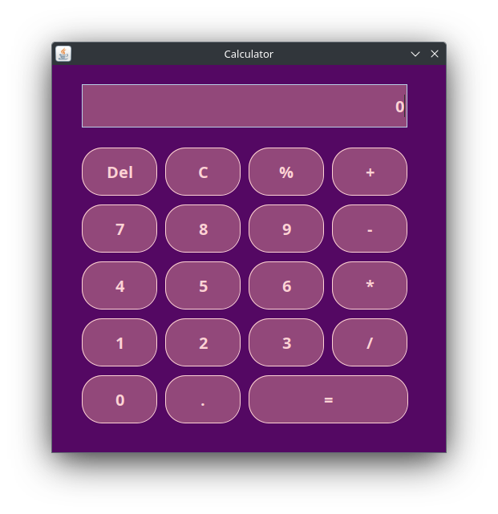
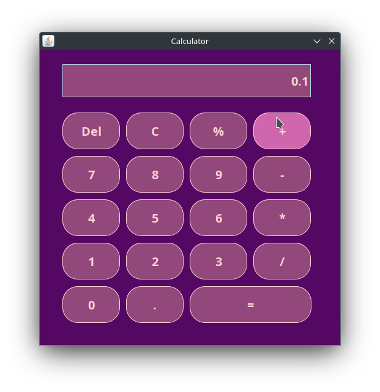
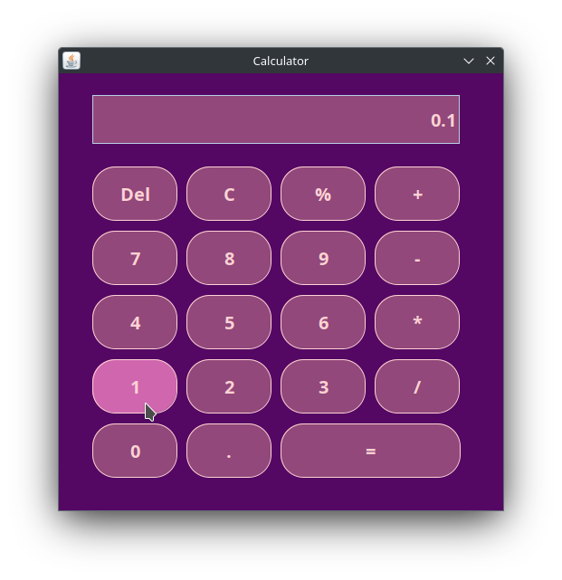

# Calculator using Java Swing


A simple calculator application implemented in Java Swing with basic arithmetic operations. This calculator supports addition, subtraction, multiplication, division and percent.

## Features

- User-friendly interface
- Responsive design
- Clear button to reset the input
- Del button to remove previous digit
- Real-time arithmetic calculations

## How to Use

1. Enter the numerical values using the number buttons (0-9).
2. Perform arithmetic operations using the respective buttons.
3. Use the decimal point button for decimal numbers.
4. Press the "C" button to reset the input.
5. Press the "Del" to remove the last digit
6. Press the "=" button to display the result of the operation.

## Implementation

The calculator is implemented in Java using Java Swing for the graphical user interface. The `GUI` class extends `JFrame` and implements the `ActionListener` and `JButton`interface to handle button clicks and change how the button looks.

## Project Structure

- **GUI.java**: Contains the main implementation of the calculator.
- **README.md**: Project documentation.
- **images**: Directory for storing images related to the project.

## Output



<div>
  
</div>

## How to Run

Compile and run the `GUI.java` file. Ensure you have a compatible Java Development Kit (JDK) installed on your system.

```bash
javac GUI.java
java GUI
```

Feel free to contribute, report issues, or suggest improvements!

Happy Coding! 👨🏻‍💻✨
also thanks to [AHBRIJESH](https://github.com/AHBRIJESH/Calculator-Using-java/blob/main/README.md) for ~~stealing~~ copying your README
